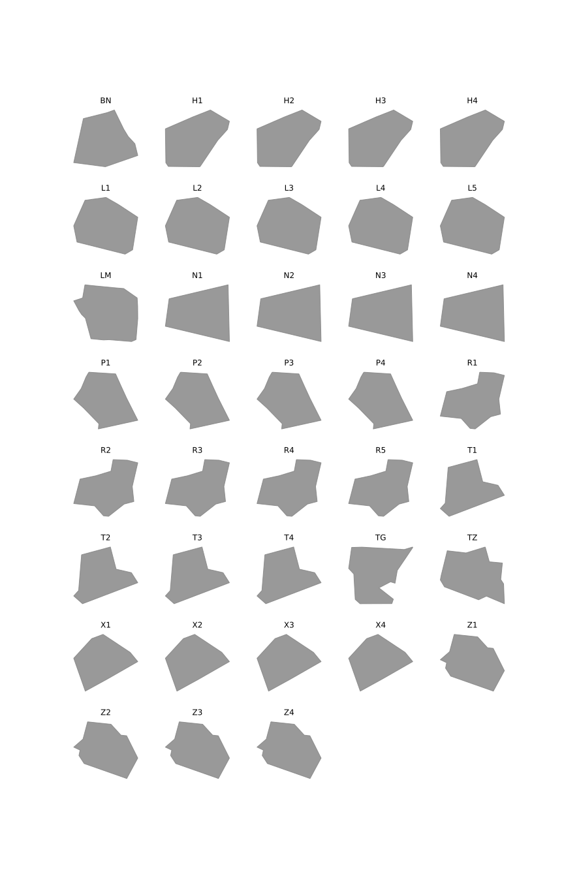

# 2D visualization of French Air Traffic Control en-route elementary sectors of Metropolitan France

Air traffic control sectors data are extracted from the [SIA website](https://www.sia.aviation-civile.gouv.fr) in the eAIP section (ENR 3.8) with [Beautiful Soup](https://www.crummy.com/software/BeautifulSoup/bs4/doc/). 
A 2D visualization of elementary sectors is then realized with [GeoPandas](http://geopandas.org/), [Matplotlib](https://matplotlib.org) and [descartes](https://pypi.org/project/descartes/).

Example: display all elementary sectors of the French ACC LFBB

## Running the tests

Run atc_sectors_2D.ipynb

## Built With

* [Beautiful Soup](https://www.crummy.com/software/BeautifulSoup/bs4/doc/) - Python library for pulling data out of HTML and XML files
* [GeoPandas](http://geopandas.org/) - GeoPandas is an open source project which extends the datatypes used by pandas to allow spatial operations on geometric types. 
* [Matplotlib](https://matplotlib.org/) - Python 2D plotting library
* [descartes](https://pypi.org/project/descartes/) - Python library to use geometric objects as matplotlib paths and patches

## Authors

* **Thomas Dubot** 

## License

This project is licensed under the MIT License - see the [LICENSE.md](LICENSE.md) file for details

## Acknowledgments

eAIP is provided by the French Aeronautical Information Service  [SIA](https://www.sia.aviation-civile.gouv.fr)

